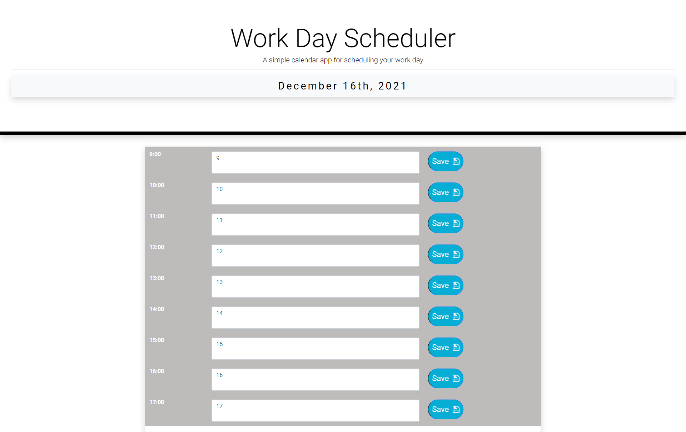

# Business Hour's Workday Scheduler 
- https://github.com/warrenhaskins1/day-planner-05
- https://warrenhaskins1.github.io/day-planner-05/

## Description

- This is an app which allows the user to make a note during a chosen timeslot.
- Depending on the hour of the day, the user can check their schedule using a color code at-a-glance.
- The goal was to use the lessons from this unit to build out an app that brings them all together.

## Installation 

- The only thing neccessary to use this project are a device with a web-browser and internet connection.

## Usage

- The user may access the webpage to get an overview of my first Web Design Portfolio which is an ongoing work in progress.

## Credits

- https://www.w3schools.com/
- https://github.com
- https://developer.mozilla.org/en-US/
- https://momentjs.com/